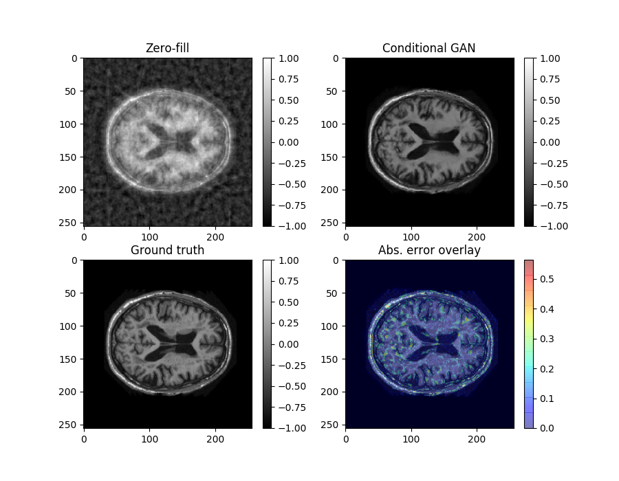

# Image artefact removal using deep convolutional neural networks

Tensorflow/Keras implementation of deep convolutional neural network (CNN) models that can be used for artefact removal. In particular, this implementation has been used to remove artificially-induced turbulent artefacts (see [3]) from brain MRI.

The conditional GAN (cGAN) model consists of a generator network and a discriminator network. The generator takes noisy/artefact images as input, with the objective of getting as close to the true image as possible. The discriminator model takes true images or generated images as input, with the objective of distinguishing the two as accurately as possible. And so the networks engage in a fierce contest for loss supremacy...

The generator network model is based on U-Net, from [1].

Some choices in structure and model architecture were helped by the GalaxyGAN model: [Python implementation](https://github.com/jacobic/galaxygan), [paper](https://academic.oup.com/mnrasl/article/467/1/L110/2931732) [2].

## Install
Written to be compatible with Python 2.7 or 3.4 and above, but only tested on 2.7.13 and 3.6.7.

You will need [TensorFlow](https://www.tensorflow.org/install/), set up appropriately for your machine.

You can see the required Python packages listed in `environment.yml`. If you use Anaconda, you can use this file to install the authors' environment (note `tensorflow-gpu` is used, which requires a GPU):

    conda env create -f environment.yml

## Configure
Most of the configurable parameters in the program are controlled in `config.py`. For example, `data_path` is the path to the training, validation and test data (by default it expects `train`, `validate`, `test` subfolders). 

## Run
The current demo trains the cGAN to remove turbulent artefacts:

    python test_undersampled.py

Model parameters will be saved to a subfolder in `config.Config.model_path`, named by the datetime of the start of the program run. Optionally, intermediate summaries or test results can be saved to `config.Config.results_path` with the same naming convention.

Example result from model evaluation:

## Existing experiments

Commit `06f6df51cd95ed8bebe77524ba8d4bde93068cfb` on branch `exp-v1` is where results were obtained for Ben Cottier's presentation to the UQ deep learning working group, summer 2018/2019. The training data came from scans in the OASIS Brains volume 1 dataset (https://www.oasis-brains.org/), taking 5 central axial slices from each scan. Note that the latest commit is not as thoroughly tested as e.g. `3485bc5ec36bbfdf5697d92b3ae88a0a9d175ed6`, so if there are problems with training, reverting is one thing to try.

- All 20 epochs
- Full cGAN
  - Run 1: (PSNR = 30.07560)
    - Checkpoint: 2018-12-17-16-20-36
  - Run 2: (PSNR = 28.1992)
    - Checkpoint: 2018-12-20-10-45-11
  - Run 3: (PSNR = 30.3749)
    - Checkpoint: 2018-12-20-11-17-22
- Pure L1 loss (no discriminator, just U-Net)
  - Run 1: (PSNR = 31.0650)
    - Checkpoint: 2018-12-19-17-39-51
  - Run 2: (PSNR = 31.2693)
    - Checkpoint: 2018-12-20-12-39-54
  - Run 3: (PSNR = 31.0140)
    - Checkpoint: 2018-12-20-13-13-39
- Pure cGAN (no L1 loss)
  - Run 1: (PSNR = 18.7565)
    - Checkpoint: 2018-12-19-18-05-16

Rerunning from above checkpoints
- If you get weird results, check:
  - Checkpoint data file name
  - Whether you are using the "latest checkpoint" function. For old checkpoints, specify the direct path e.g. `checkpoint.restore(os.path.join(model_path, 'ckpt-1'))`)
  - The model (is the model setup code for full cGAN, U-Net or pure GAN?)

## Future work

- Sigmoid cross-entropy loss functions in GANs tend to be unstable. Least-squares GAN or Wasserstein loss are alternatives to consider.
- Quality would improve significantly with a data consistency operation on the output, which ensures the informatio from true measurements is preserved rather than the model overwriting them.

## References
[1] Ronneberger, Olaf, Philipp Fischer, and Thomas Brox. "U-net: Convolutional networks for biomedical image segmentation." In International Conference on Medical image computing and computer-assisted intervention, pp. 234-241. Springer, Cham, 2015.

[2] Schawinski, Kevin, Ce Zhang, Hantian Zhang, Lucas Fowler, and Gokula Krishnan Santhanam. "Generative adversarial networks recover features in astrophysical images of galaxies beyond the deconvolution limit." Monthly Notices of the Royal Astronomical Society: Letters 467, no. 1 (2017): L110-L114.

[3] Chandra, Shekhar S., Gary Ruben, Jin Jin, Mingyan Li, Andrew M. Kingston, Imants D. Svalbe, and Stuart Crozier. "Chaotic Sensing." IEEE Transactions on Image Processing 27, no. 12 (2018): 6079-6092.
